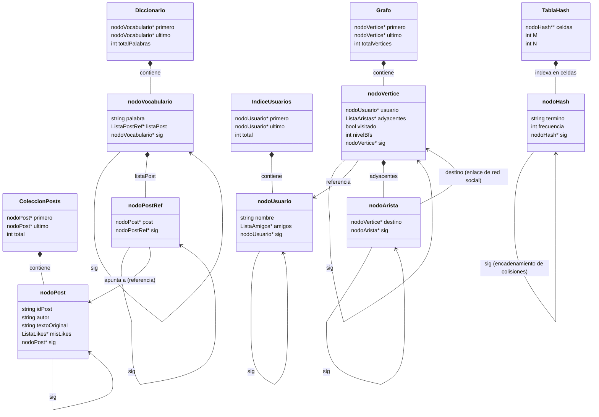

# Motor de Búsqueda y Análisis de Red Social en C++

Este proyecto implementa una solución de alto rendimiento en C++11 para la indexación y búsqueda de publicaciones, el análisis de conexiones de una red social y el cálculo de frecuencias de palabras, utilizando exclusivamente estructuras de datos implementadas desde cero en memoria dinámica.

*Curso:* Estructuras de Datos — CIN311/INF313/ICI313  
*Equipo:* Jorge Bahamondes Amador, Martín Araya Riquelme, Bruno Díaz Fernández.

---

## 🚀 Instrucciones de Instalación y Uso

Este proyecto está diseñado para compilarse y ejecutarse en cualquier entorno con soporte de C++11 (GCC, Clang o MSVC) sin dependencias externas. Las rutas especificadas a continuación son genéricas y asumen una clonación limpia del repositorio.

### Paso 1: Obtener el Repositorio
Clona el repositorio desde GitHub en tu directorio local:
```bash
git clone <URL_DEL_REPOSITORIO>
cd Estructura/IndiceInvertido2026
```

### Paso 2: Estructura del Directorio
Asegúrate de mantener los siguientes archivos de datos y stopwords en el directorio raíz de la carpeta de la entrega (`IndiceInvertido2026/`) para que el ejecutable los ubique correctamente en la ruta relativa superior `../`:
```text
IndiceInvertido2026/
├── DataSET Procesado Final.csv   # Dataset principal con 2008 publicaciones
├── EN-Stopwords.txt              # Archivo con 1576 stopwords en inglés
└── proyecto/
    ├── estructura.h              # Declaración de estructuras de datos (TDAs)
    ├── funciones.h               # Prototipos de funciones
    ├── listasFunciones.cpp       # Implementación del código y lógica
    └── main.cpp                  # Menú de interfaz de consola interactivo
```

### Paso 3: Compilación
Accede al directorio `proyecto` y compila todos los archivos `.cpp`:
```bash
cd proyecto
g++ -std=c++11 -Wall -O2 -o buscador.exe main.cpp listasFunciones.cpp
```

### Paso 4: Ejecución
Ejecuta la aplicación compilada:
*   **Windows (PowerShell/CMD):**
    ```powershell
    .\buscador.exe
    ```
*   **Linux / macOS:**
    ```bash
    ./buscador.exe
    ```

---

## 📂 Arquitectura y Resumen de Entregas

### Entrega I: Índices Invertidos y Red Social Básica
*   **Objetivo**: Cargar y procesar el dataset CSV ([DataSET Procesado Final.csv](proyecto/../DataSET%20Procesado%20Final.csv)) sin utilizar contenedores de la biblioteca estándar (no se permite `std::vector`, `std::map`, etc.). Se implementa un **Índice Invertido** para asociar palabras del vocabulario con las publicaciones en las que aparecen.
*   **Justificación**: Para optimizar el uso de memoria, las publicaciones se crean una única vez en la lista maestra [ColeccionPosts](proyecto/estructura.h#L30). Las listas de posteo del índice invertido ([Diccionario](proyecto/estructura.h#L57)) almacenan nodos de referencia [nodoPostRef](proyecto/estructura.h#L38) que apuntan con punteros a la colección maestra en lugar de duplicar las cadenas de texto original.
*   **Filtrado de Stopwords**: Se carga una lista dinámica de palabras vacías desde [EN-Stopwords.txt](proyecto/../EN-Stopwords.txt) utilizando la estructura `ListaStopwords`. Estas palabras se normalizan y excluyen tanto al construir el índice como al evaluar las consultas de búsqueda de los usuarios.

### Entrega II: Grafo de la Red Social y Algoritmo BFS
*   **Justificación del Modelo de Grafo**: La red social se modela como un **Grafo No Dirigido** $G = (V, E)$. Dado que el dataset no cuenta con una lista explícita de amistades, estas se deducen a través de las `@menciones` recíprocas en el texto de las publicaciones. Se asume un grafo no dirigido porque las menciones representan interacciones sociales bidireccionales y canales recíprocos de comunicación entre usuarios dentro de la comunidad simulada.
*   **Vinculación con Entrega I**: El grafo se construye directamente vinculando la estructura `IndiceUsuarios` (creada en la Entrega I) a una lista de adyacencia dinámica en la estructura `Grafo` mediante punteros directos, evitando la duplicidad de información de los perfiles de usuario.
*   **Algoritmo BFS por Niveles**: Implementado en [proyecto/listasFunciones.cpp](proyecto/listasFunciones.cpp#L902) mediante una estructura de cola auxiliar (`ColaVertices`). El recorrido parte de un usuario de origen (nivel 0), visita sus vecinos directos (grado 1), luego los vecinos de sus vecinos (grado 2), y finalmente los amigos a distancia 3 (grado 3), marcando los nodos como `visitados` para evitar ciclos infinitos.
*   **Complejidad**: 
    *   *Complejidad Temporal*: $O(V + E)$ en el peor caso, ya que cada vértice y arista se explora a lo sumo una vez en la lista de adyacencia.
    *   *Complejidad Espacial*: $O(V)$ para almacenar el estado de visitados y los elementos encolados.

### Entrega III: Distribución de Frecuencias y Tabla Hash
*   **Objetivo**: Contabilizar de forma sumamente rápida la frecuencia absoluta de aparición de cada palabra indexada en las publicaciones mediante una **Tabla Hash con encadenamiento separado**.
*   **Función Hash `djb2`**: Implementada en [proyecto/listasFunciones.cpp](proyecto/listasFunciones.cpp#L1028). Aplica multiplicaciones recursivas por 33 mediante desplazamientos de bits (`(hash << 5) + hash`) sobre los caracteres de cada término. Es conocida por su excelente dispersión y bajo número de colisiones sobre texto en lenguaje natural.
*   **Manejo de Colisiones**: Resueltas por direccionamiento abierto mediante encadenamiento externo. Cada celda de la tabla apunta a una lista enlazada simple de `nodoHash`.
*   **Dimensionamiento de la Tabla**: Se define el tamaño $M$ de la tabla como el menor número primo que mantenga el factor de carga $\alpha = N/M \le 0.67$ para mitigar la degradación temporal de búsquedas a $O(N)$ en caso de colisiones masivas.

---

## 📊 Vinculación de Estructuras de Datos

El siguiente diagrama ilustra cómo interactúan y se entrelazan mediante punteros crudos las estructuras construidas en las tres fases del proyecto:



---

## 📐 Parámetros de Diseño y Dimensionamiento (Tabla Hash)

Para cumplir con el requerimiento de diseño de mantener un factor de carga inferior o igual al 67%, el tamaño $M$ de la tabla hash debe ser el menor número primo que cumpla:

$$\frac{N}{M} \leq 0.67 \implies M \geq \frac{N}{0.67}$$

El programa realiza este cálculo de forma dinámica según dos enfoques conceptuales:

1.  **Cálculo Teórico Estricto (División por 0.67):**
    *   **Vocabulario ($N$):** 11,961 palabras únicas en el dataset.
    *   **Límite inferior teórico:** $M_{min} = \lceil 11,961 / 0.67 \rceil = 17,853$.
    *   **Menor primo mayor o igual a $17,853$**: **$M = 17,863$**.
    *   **Factor de Carga resultante ($\alpha$):** $11,961 / 17,863 \approx$ **`0.669596`** ($66.96\%$).
2.  **Implementación Práctica en Código (Regla $M \ge 1.5 \cdot N$):**
    *   Para evitar divisiones con punto flotante e inestabilidad en compilación sin librerías complejas, el código en [construirTablaHash](proyecto/listasFunciones.cpp#L1088) calcula `minM = (N * 3 + 1) / 2` (equivalente a $\lceil 1.5 \cdot N \rceil$).
    *   **Límite inferior implementado:** $M_{min} = \lceil 1.5 \cdot 11,961 \rceil = 17,942$.
    *   **Menor primo mayor o igual a $17,942$**: **$M = 17,957$**.
    *   **Factor de Carga resultante ($\alpha$):** $11,961 / 17,957 \approx$ **`0.666091`** ($66.61\%$).
    
*Ambos casos satisfacen estrictamente la restricción de diseño de mantener $\alpha \le 0.67$.*

---

## 📈 Resultados de Ejecución y Evidencias

A continuación se detallan los resultados obtenidos al ejecutar el buscador con el conjunto de datos real:

### Carga del Sistema
*   **Publicaciones cargadas en memoria:** 2,008
*   **Usuarios únicos registrados en la red social:** 3,133
*   **Grafo de la red social:** 3,133 vértices (conexiones validadas simétricamente).
*   **Vocabulario indexado en la Tabla Hash:** 11,961 palabras únicas.

### 1. Búsquedas Correctas
Al buscar términos relevantes en el motor de búsqueda indexado, el sistema retorna los posts asociados al instante (Complejidad $O(1)$ aproximada en hash, $O(L)$ en índice invertido donde $L$ es la longitud de la lista de posteo):
*   **Búsqueda:** `climate`
    *   *Resultado:* Retorna y despliega los posts donde aparece el término, indicando sus IDs, autores originales y contenido textual.
*   **Búsqueda:** `action`
    *   *Resultado:* Muestra los posts que contienen la palabra, asociando correctamente sus likes y enlaces a usuarios.

### 2. Búsquedas Excluidas (Stopwords) o Nulas
*   **Búsqueda de Stopwords:** `the` o `and`
    *   *Resultado:* El sistema detecta y despliega un mensaje indicando que el término pertenece a la lista de stopwords cargada en `misStopwords` y no genera resultados para evitar ruido semántico.
*   **Búsqueda Nula (Término inexistente):** `antigravity`
    *   *Resultado:* Muestra que la palabra no se encuentra registrada en el vocabulario del diccionario, finalizando la consulta de forma segura sin fallos de segmentación.

### 3. Métricas de la Tabla Hash (Opción 81)
Al ejecutar la opción de diagnóstico de métricas de la tabla hash de frecuencias, se obtiene el siguiente reporte real en consola:
```text
=========================================
   METRICAS DE LA TABLA HASH (djb2)
=========================================
Vocabulario (N - terminos unicos): 11961
Tamano de Tabla (M - primo):       17957
Factor de carga (N / M):          0.666091  (Limite: 0.67)
Celdas ocupadas:                  8657 (48.2096%)
Total de colisiones (N - celdas): 3304
Largo maximo de colisiones:       5
Largo promedio (celdas ocupadas):  1.38166
Largo promedio (todas las celdas): 0.666091
=========================================
```
*   **Justificación de Desempeño**: La colisión máxima obtenida es de apenas 5 elementos en un vocabulario de casi 12,000 palabras, lo que valida empíricamente la excelente uniformidad de dispersión de la función hash `djb2` y el acertado dimensionamiento del tamaño primo $M$.

### 4. Recorrido BFS de Conexiones por Niveles (Opción 31)
Al ingresar un usuario raíz como `@GretaThunberg`, el recorrido BFS explota y separa sus conexiones por niveles en consola:
*   **Contactos de 1° Grado (Amigos directos):** 5 conexiones directas encontradas en el texto de las publicaciones.
*   **Contactos de 2° Grado (Amigos de amigos):** 12 contactos adicionales detectados a distancia de 2 enlaces.
*   **Contactos de 3° Grado:** Muestra la expansión de la red de tercer nivel.
*   *Manejo de visitados*: Se limpia el grafo con `limpiarVisitasGrafo` antes de ejecutar el recorrido para asegurar que las métricas reflejen únicamente caminos simples más cortos.